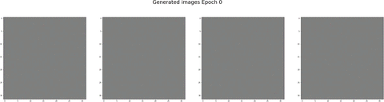
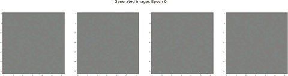

# GANde

Process of gathering data and training GAN to generate faces of the American singer Ariana Grande

Steps
1. Use OpenCV `face_recognition` to box face of Ariana Grande from full sized pictures
2. Crop face into training set
3. Set up GAN architecture, train, and save process

Main tools
* Google Colab - free GPU!!!
* OpenCV
* Tensorflow

Resources

* Download pretrained model and weights from OpenCV source GitHub
  * https://github.com/opencv/opencv/tree/master/samples/dnn/face_detector
	* https://github.com/opencv/opencv/blob/master/samples/dnn/face_detector/weights.meta4
* For the GAN portion - followed amazing tutorial by Yumi Kondo
  * https://fairyonice.github.io/My-first-GAN-using-CelebA-data.html
